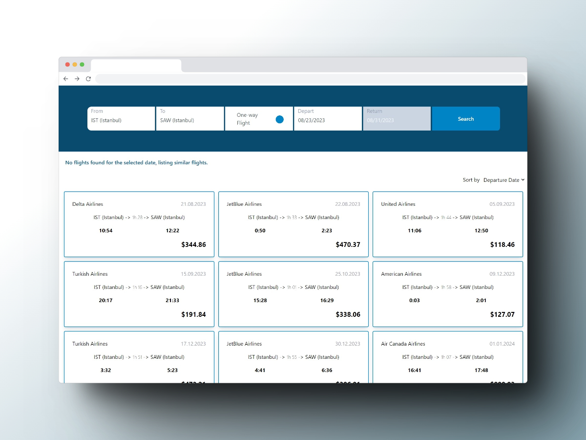
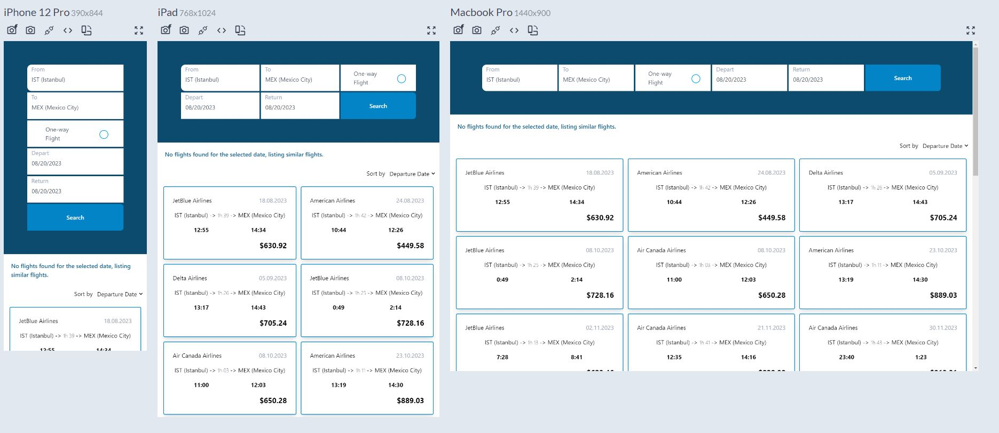

# Flight Search Application

## Introduction
Flight Search is a front-end project built with React, Tailwind and Vite. Its main aim is to give users the power to search for flights based on a range of criteria and view the resulting flight options.

[Check out live demo by clicking here.](https://cagatay-usta.github.io/flight-search-application/)

## Features
The Flight Search Application offers the following functionalities:

- **Flight Search:** Users can effortlessly search for flights using departure and arrival airports, departure date, return date, and an option for one-way flights.

- **Autocomplete:** As users type in departure and arrival airport names, autocomplete suggestions appear based on available airport data.

- **Datepickers:** Made with integrating `react-day-picker`  library, datepickers are seamlessly integrated to help users select their preferred departure and return dates.

- **Sorting:** The application enables sorting of flight results based on departure time, departure date, flight duration, and price.

- **Loading Animation:** A loading animation made with `react-spinners` is shown while waiting for flight results to be fetched.

- **Error Handling:** Various error scenarios, including network erors and empty data are addressed.

- **Validation** All fields are rigorously tested for scenarious such as empty fields, return date earlier than departure date, and unavailable destinations/input formats.

- **Mock API:** A mock API is created using data created from Mockaroo and stored as JSON to simulate server responses, providing realistic flight data for testing. Started with live fetching using Mockaroo mock API but switched to local due to API call limits and rates.

- **Responsive:** It is designed with universal approach by utilizing flexbox and grid to display perfect layouts on all screen types and sizes.

- **Accessible:** Using semantic html and labels for all fields, it is built regarding the best accessibility and SEO practices.

## Setup and Installation
You can [preview live demo here](https://cagatay-usta.github.io/flight-search-application/):

To run the Flight Search Application locally instead:

1. Clone the repository from GitHub: `git clone https://github.com/your-username/flight-search-app.git`
2. Navigate to the project directory: `cd flight-search-app`
3. Install the necessary dependencies: `npm install`
4. Start the development server: `npm run dev`

## Usage
1. Input the departure and arrival airports in the corresponding fields.
2. Utilize the datepickers to select departure and return dates.
3. If you're flying one-way, simply check the "One-way flight" option.
4. Click the "Search" button to fetch flight results.
5. Sort by using sort selection field.

## Technologies Used

- 

- 

- 

- 

- 

- 

## Folder Structure
- `src/components:` Holds individual React components.
- `src/style:` Contains tailwind base layers and modified preflight css reset layer.
- `src/api:` Manages API requests and responses.
- `src/modules:` Contains mock API module, mock data, and utility functions.
- `src/contexts:` Contains context provider and custom hooks for state management.

